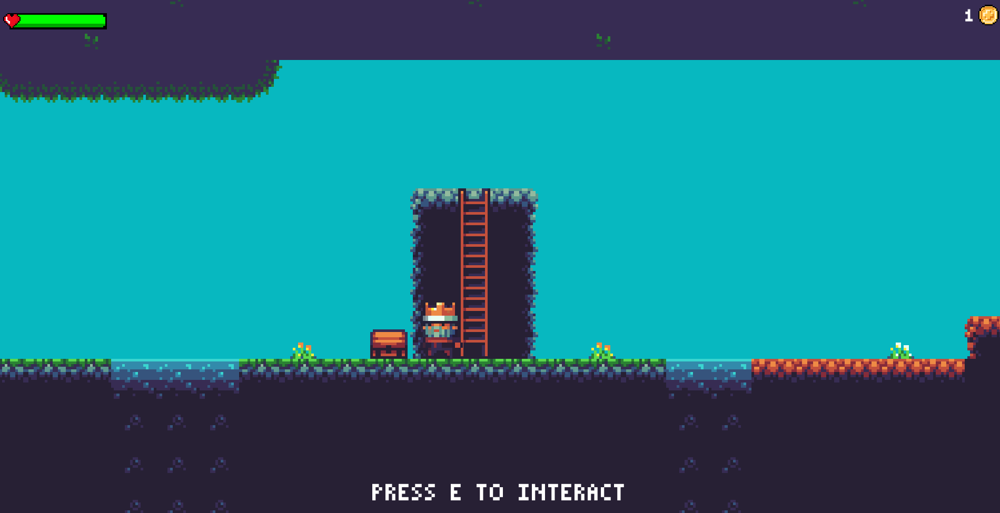

## Table des matières
1. [Info générale](#info-générale)
2. [Technologies](#technologies)
3. [Installation](#installation)

## Info Générale
***
Ce jeu est issu du tutoriel [creer un jeu en 2d facilement unity](https://github.com/TUTOUNITYFR/creer-un-jeu-en-2d-facilement-unity).


## Technologies
***
Liste des technologies utilisées dans le projet :
* [Git](https://git-scm.com/): Version 2.33.0
* [GitKraken](https://www.gitkraken.com/) Version 7.5.2
* [Unity](https://docs.unity3d.com/Manual/index.html) Version 2020.3
* [Visual Studio](https://docs.microsoft.com/fr-fr/visualstudio/windows/?view=vs-2022) Version 2022
* [C#](https://docs.microsoft.com/fr-fr/dotnet/csharp/) Version 8.0

## Installation
***
Pour installer le projet, vous pouvez le cloner avec une clé SSH, ou bien télécharger le dossier ZIP.
```
$ git clone git@github.com:tanguy-sudo/Serie-2D.git

```